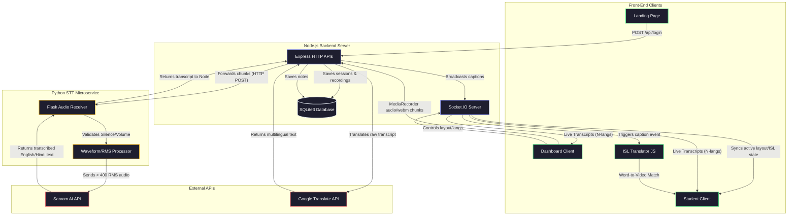

# Sarva Architecture

This document describes the high-level architecture of the Sarva platform, incorporating the new ISL Integration, Dynamic Layouts, and the Dual-Service setup.

## System Overview

Sarva is composed of a **Node.js Web & WebSocket Orchestrator** and a **Python Flask STT Microservice**. This hybrid architecture allows robust, real-time WebSocket connections and data management in Node.js, while offloading the heavy audio processing and external AI transcription (Sarvam AI) calls to a dedicated Python worker.

### Components Details

1. **Dashboard (formerly Teacher View)**: Controls the microphone, layout configuration (1-4 panels), dynamic languages, and the ISL toggle. Audio is recorded via `MediaRecorder` in `webm` chunks and posted to Node.js.
2. **Student View**: Connects silently via Socket.io. Listens for `layout-update`, `isl-visibility`, and `caption` events, adjusting its CSS Grid dynamically based on the dashboard's configuration.
3. **ISL Translator Module**: A frontend script (`isl-translator.js`) that maintains a queue of incoming transcribed English words. It resolves these words against an open-source ISL dictionary and sequentially streams gesture `.mp4` files into a dedicated WebGL/video panel.
4. **Python STT Service**: Receives raw audio chunks from Node.js, analyzes the Root Mean Square (RMS) volume to skip silent segments (saving API costs), and passes valid chunks to the **Sarvam AI** translation API.
5. **Database**: A `better-sqlite3` instance managing sessions, recordings, user accounts, and session notes using Write-Ahead Logging (WAL) for high concurrency.
